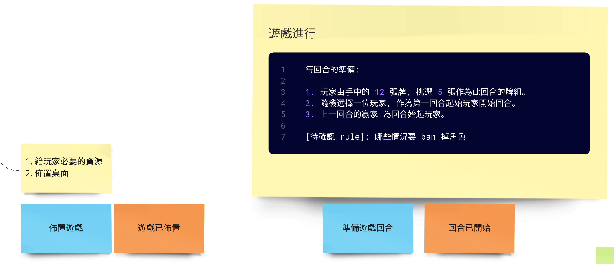

## 2023 軟體開發技能複習計劃

為了讓好不容易獲得的新知徹底遺忘復習是最佳的手段！

不管，你是使用 [遺忘曲線](https://zh.wikipedia.org/zh-tw/%E9%81%97%E5%BF%98%E6%9B%B2%E7%BA%BF) | [參考資料](https://www.youtube.com/watch?v=zbu9WBAZCZE)
還是各種的學習理論，要把學過的東西再次掌握，就是得在那個要忘不忘的時刻來做才會效果顯著！。

這回合要復習的主要內容是來自《水球軟體學院的遊戲微服務計劃》線上讀書會的相關內容，過去的資料可以參考 [動機篇](docs/motivation.md)。

## 複習進度

相關進度的 YouTube 記錄如下：

| 場次    | 摘要                                                                                                        |
|-------|-----------------------------------------------------------------------------------------------------------|
| 第一回   | [簡單看一下遊戲介紹](https://www.youtube.com/watch?v=b-lr7aRmjBg)                                                  |
| 第二回   | [蒐集遊戲規則, 並精簡出一版文字規則](https://www.youtube.com/watch?v=4NnSTflmih0)                                         |
| 第三回   | [蒐集遊戲卡牌資訊, 並整理佈局資料](https://www.youtube.com/watch?v=JQFVOQ8LNTM)                                          |
| 第四回   | [Event Storming](https://www.youtube.com/watch?v=eZeaLqyz1ss)                                             |
| 第五回   | [加上 Command 與 Rule](https://www.youtube.com/watch?v=dUl3J6j8UrU)                                          |
| 第五點五回 | [中場回顧](https://www.youtube.com/watch?v=sdTWeMaCuvU)                                                       |
| 第六回   | OOA [6-1](https://www.youtube.com/watch?v=HfZJAue0ioc)、[6-2](https://www.youtube.com/watch?v=t-MaN5L8qsA) | 
| 第七回   | [Walking Skeleton](https://youtu.be/65vgFa4gBXE)                                                          |
| 第八回   | 8-1 [計劃一下 ATDD 要涵蓋的範圍](https://youtu.be/PQiFmegOP8o)                                                      |
|       | 8-2 [開始實作 Happy Path：佈置遊戲](https://youtu.be/N81QaWKeXnY)                                                  |
|       | 8-3 [實作玩家回合準備 (上)](https://youtu.be/PTd9j_a3AaA)                                                          |
|       | 8-3 [實作玩家回合準備 (下)](https://youtu.be/8Cc55aWnzjQ)                                                          |
|       | 8-4 [玩家行動 API (上)](https://youtu.be/MoRxX3b44aA)                                                          |
|       | 8-4 [玩家行動 API (下)](https://youtu.be/C37tRU-l5y8)                                                          |

### 5/2 中場回顧

趁著連假推了一下進度，把遊戲規則大致上看了，也找先畫了一條 Happy Path：遊戲開始、所有玩家都拿到了需要的東西，桌面也佈置完成，直到某一位玩家贏得角色。

儘可能走輕量化的 Event Storming 流程，所以大致上在二次內搞定，第 1 次找 Domain Event，第 2 次弄 Command 與
Rule。其它就先忽略，後面有需要再補就好。

接著，可能做一些 OOA 的開頭，再來弄點不太需要有 Domain Knowledge 的 Walking Skeleton，有了基礎建設後就可以來做 ATDD 與
Example Mapping 囉！Example Mapping 同樣是有用到才討論，ATDD 戰霧開到哪 Example Mapping 才做到那邊。

### 5/14 起頭開工 Happy Path

在第八回開始，我們會大量提高實作的比例。畢竟，先前討論的內容，已經足夠用來實作很多東西了。
在那之前，我們還不需要進展到 Example Mapping 下去展開各種「舉例說明」。單純，先滿足實作中最 `快樂` 與 `單純` 的部分。

在這次的實作過程中，我們有提到 Clean Architecture，但在初期只是借用它的概念，並沒有打算要完美地實作出這樣的架構，只是先稍為對應一下。
儘管沒有這麼規劃但該有的「責任」並不會因為沒有依特定架構實作就消失，只是它會混雜在一起罷了。

### 5/21 實作玩家回合準備

接續著前一次進度「建立遊戲」之後，我們開始實作玩家回合準備的 API。在這裡，個別的玩家可以指令自己在這回合要使用的 5 張角色卡。

在這階段，玩家會各自提交 5 張要使用的卡片，最後一位玩家完成準備，遊戲就可以進入「回合已開始」的階段了。
這即可以反應出 Aggregate Root 是一種狀態機的概念：

延續著先前的實作節奏，還沒用到的就不理它。所以，我們的「準備遊戲回合」只替使用者建立了 RoleCard 類別，其它資源先忽略。
而 RoleCard 類別，目前還沒有真的實作遊戲中真實的卡片。

那些真實的卡片不見得需要那麼早就做出來，我們可讓「流程完備」與「充實概念」是可以分開的。
針對流程上的遊戲機制可以先行，後續只是將具體的概念充實而已。

### 5/26

這週接著先前「準備遊戲回合」之後，我們完成了「玩家行動」的 API。
玩家有 3 種行動，但不管那一種導出的結果都會是「玩家已完成動作」，與 Game Aggregate 內部的狀態轉變罷了。

「玩家已完成動作」跟先前的結構相似，經過數位玩家行動後它才會轉移狀態，再次回到「回合已開始」並由上一輪成功取得角色的玩家為新的「起始玩家」。

這回我們讓設定的 Happy Path 走到了第 1 位玩家宣告角色 (claim_role)，
其它玩家都因為沒有同樣的角色卡而選擇了 PASS。
在所有玩家都**做過動作** 之後，就轉移狀態。

截至目前為止，我們都專注在滿足流程上要經過的路徑。
在這歷程中，我們只專注在會用到的功能，因此這回的實作並不包含 *同意其他玩家的角色* (agree_role) 的功能。

這回實作的尾端，我們簡單列了一些 TODO 是需要完善的細節，它也會對應到 Event Storming 中討論到的 Rule。
這部分比起繼續 ATDD，它更適用 TDD 來局部精緻調整，再回溯到上層的「規格定義」，就讓在之後的內容中，帶出 Example Mapping 的部分了。

